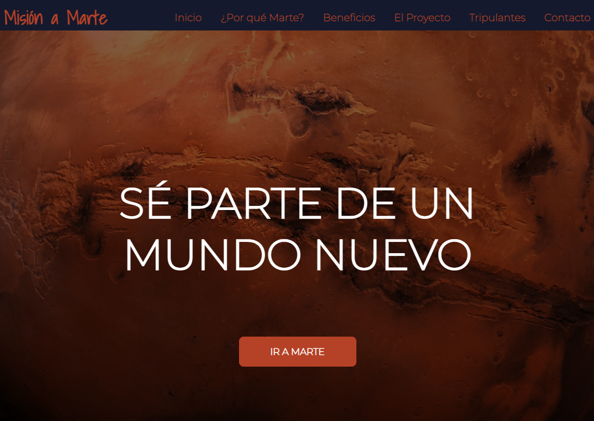
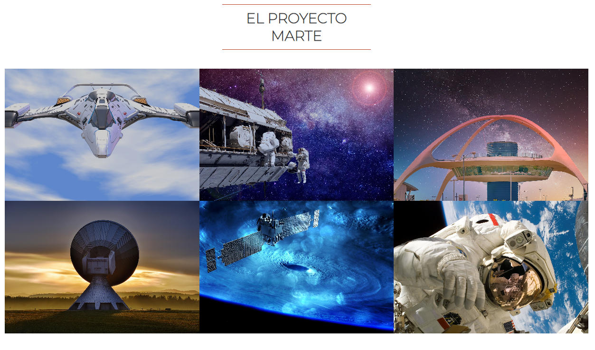

#PROYECTO MARTE

Una página web estilo "one page" con enlaces internos a diferentes secciones, con una llamada a la acción hacia un formulario, en el que las personas se podrán apuntar para ser parte de la primera colonización a Marte. La página web está dividida en las siguientes partes:

-Home

-Por qué Marte? (About)

-Beneficios

-El proyecto

-Tripulación

-Auspiciantes

-Formulario de contacto

-Footer (creador)
